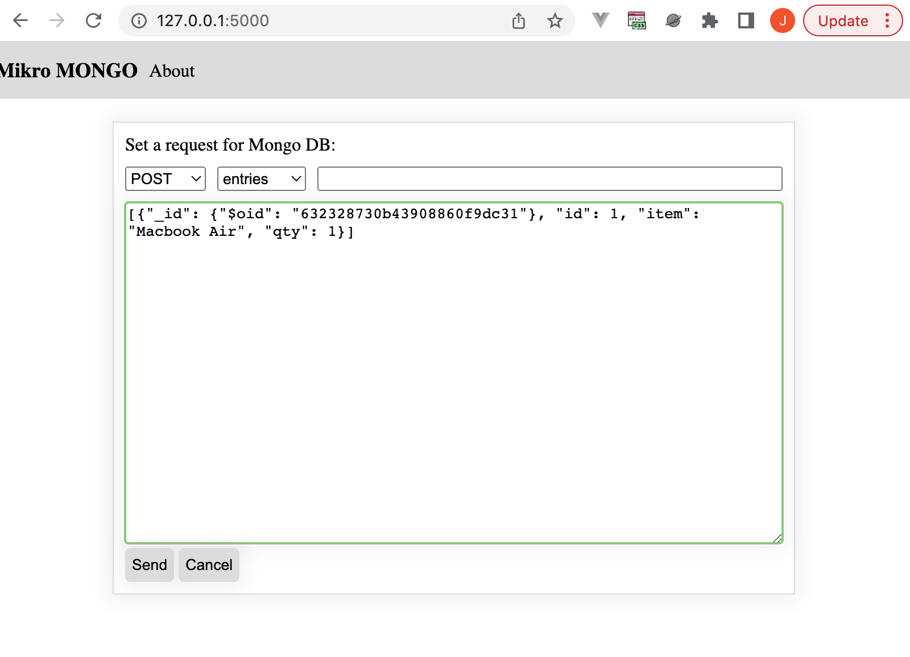

# API обертка над базой данных Mongo DB

Обертка написана для использования совместно с интерактивным Telegram ботом, который разрабатывался с целью оперативного мониторинга и управления корпоративными маршрутизаторами. Обертка имеет веб-интерфейс, для тестирования запросов к базе данных.



# Содержание

- [Установка](#установка)
  - [Переменные окружения](#установите-переменные-окружения)
- [Процедура запуска](#процедура-запуска)
  - [Запуск web-сервера](#запуск-web-сервера)
- [Использование web-интерфейса](#использование-web-интерфейса)

# Установка

Клонируйте репозиторий, и создайте виртуальное окружение. После этого установите зависимости:

```
$ python3 -m venv env
$ . env/bin/activate
(env) $ pip install -r requirements.txt
```

Запустите базу данных Mongo DB, локально или в докере. Информацию по развертыванию сервера MongoDB можно найти в официальной документации [www.mongodb.com](https://www.mongodb.com/docs/manual/installation/)


## Установите переменные окружения

`DB_NAME` - Имя базы данных.
`DB_CONNECTION_STRING` - Строка подключения к серверу mongo db (0.0.0.0:27017).
`ROLLBAR_TOKEN` - Токен rollbar.

# Процедура запуска


## Запуск web-сервера:

```bash
$ python app.py
```

Перейдите на адрес хоста, по умолчанию [127.0.0.1:5000](http://127.0.0.1:5000/).
Весь вывод информации о выполнении перенаплавлен в файл mikroMongo.log, который создается автоматически при первом запуске скрипта.


# Использование web-интерфейса

Поле выбора типа запроса (POST или GET), установлено по умолчанию, всегда POST. Добавлено для дальнейшего расширения функционала.
Следующее поле выбора - вид запроса:
`submit` - для вывода информации о подключении к базе данных, используется для теста успешного подключения.
`collection` - для работы с документами или коллекциями (добавление/удаление)
`entries` - для работы с записями в коллекции (добавление/удаление/получение)
Последнее текстовое поле - параметры запроса. Правила задания строки параметров следующие:
- Разделение параметров в строке знаком &
- Первый параметр всегда наименование коллекции
- Второй параметр действие над объектами базы данных. Они соответсвуют названиям методов из документации компоненты [pymongo](https://pymongo.readthedocs.io/en/stable/api/pymongo/
collection.html?highlight=collection)
- Следующий параметр это json строка с данными
Результат выполнения по кнопке Send, отображается в текстовом поле ниже на форме.
